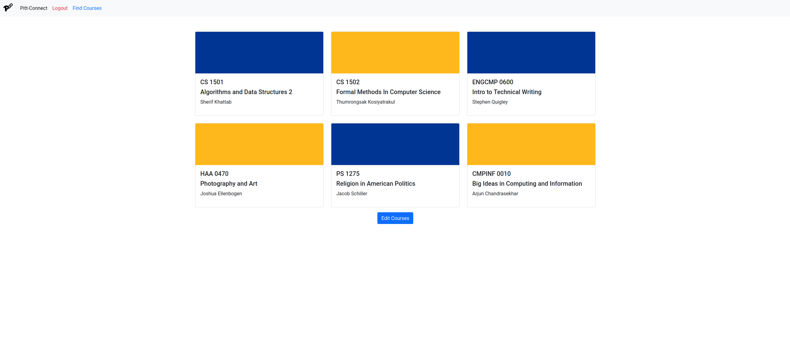
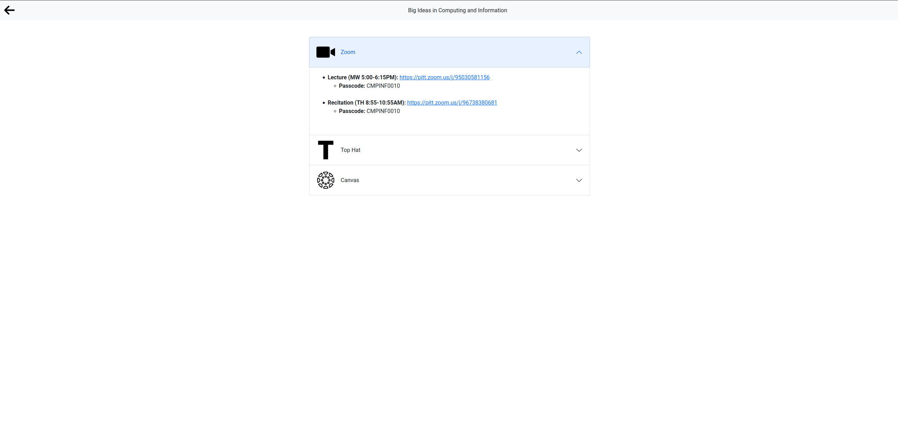
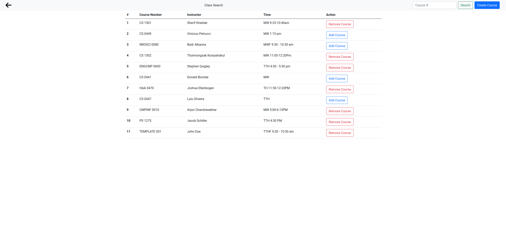

# Pitt Connect
**A SteelHacks 2021 project.**

## **Description**

During COVID-19, all coursework at the University of Pittsburgh was administered online. This came with it a heap of class resource links for things like zoom meetings, tophat, gradescope, and others. Each professor stored these links in different places making them difficult to find and manage. So we created Pitt Connect as a part of Steelhacks 2021 which is a web app that manages all your course links for you and shares them with other students at the university.

## **Role**

I came up with the idea for the project, did most of the frontend, and created the demo video

## **Skills Utilized**

* Flask
* Python
* Javascript
* Bootstrap
* Github
* HTML
* CSS

## **Outcome**

First place in student life category for Steelhacks 2021

Check out our hillarious demo video: [Demo Video](https://www.youtube.com/watch?v=aSYA27kUS2U&embeds_referring_euri=https%3A%2F%2Fdevpost.com%2F&source_ve_path=OTY3MTQ&feature=emb_imp_woyt)

## **Key Takeaways**

When you work on something you are passionate about or with people you enjoy it really does not feel like work.

Home Screen

Example of a Class

Class Search

Login Screen

